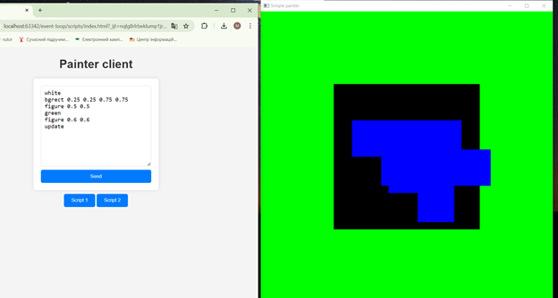

## SEC-Lab-3

The third Lab of Software Engineering Components
---

### Contributors:
- Igor Novikov 
- Maxim Sachko 
- Andriy Tymoshenko


### How to use:
1. Open terminal & clone repo to your pc:
```bash
$ git clone https://github.com/KPI-team-labs/event-loop.git
```
2. Go to your local repo directory:
```bash
$ cd event-loop/
```
3. Run local:
```bash
$ go run cmd/painter
```
4. Open the event-loop\script\index.html page in your browser

5. Use ready-made scripts or write commands manually to control the graphics window.  
   For example:
```
white
update
```
This script will fill the background with white color.

### **List of commands:**

1. **white**
    - Fills the background with white color.
2. **green**
    - Fills the background with green color.
3. **update**
    - Updates content in graphics window.
4. **bgrect x1 y1 x2 y2**
    - Draws a black rectangle over the background at the given coordinates (Upper left and lower right corners). Only the last requested rectangle will be displayed.
5. **figure x y**
    - Draws a "T" figure centered at coordinates (x;y) over the background.
6. **move x y**
    - Moves the object horizontally by X, and vertically by Y.
7. **reset**
    - Cleans information about background and all added objects created with "figure" and "bgrect". And fills the background in black.

## Ready scripts
1. **Script 1 (Green border)**  
   Contains the following commands:
```
reset
green
bgrect 0.02 0.02 0.98 0.98
update
```
This script creates a black rectangle in a bold green frame (background).

2. **Script 2 (Diagonal movement of the figure)**  
   Contains the following commands (1st request):
```
reset
white
figure 0.1 0.1
update
```
2nd request (Sent every second, 9 times in total):
```
move 0.1 0.1
update
```
This script makes a white background and moves our figure around the perimeter of the window at certain intervals.

## Custom scripts
You can also write your own scripts to control the graphics window:  
